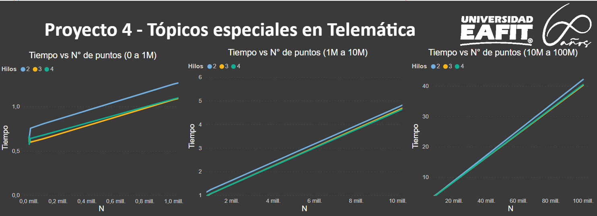
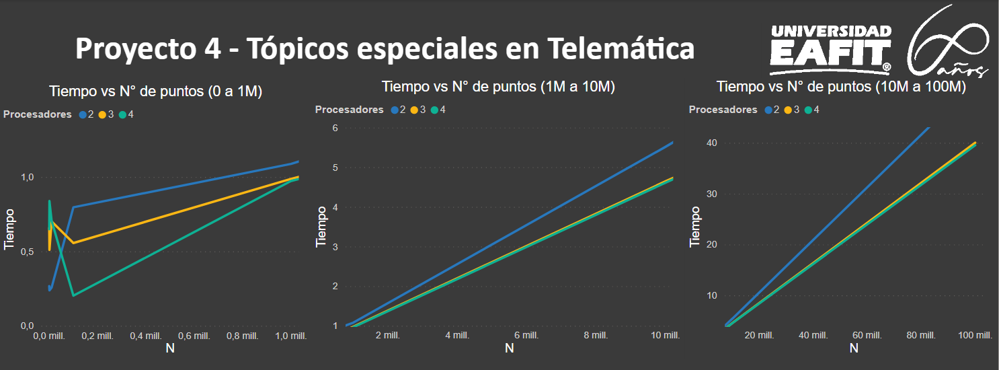

# Proyecto Final HPC (Método Monte Carlo para calcular el valor de π )

- [Proyecto Final HPC (Método Monte Carlo para calcular el valor de π )](#proyecto-final-hpc--m-todo-monte-carlo-para-calcular-el-valor-de----)
  * [Desarrolladores](#desarrolladores)
  * [Desarrollo](#desarrollo)
  * [Compilación y ejecución](#compilaci-n-y-ejecuci-n)
    + [Monte Carlo secuencial](#monte-carlo-secuencial)
    + [Monte Carlo paralelo OpenMP (pymp)](#monte-carlo-paralelo-openmp--pymp-)
    + [Monte Carlo paralelo MPI (mpi4py)](#monte-carlo-paralelo-mpi--mpi4py-)
  * [Análisis de resultados](#an-lisis-de-resultados)
    + [Comparación de los distintos métodos](#comparaci-n-de-los-distintos-m-todos)
    + [Comparación de resultados respecto al numero de hilos (OpenMP)](#comparaci-n-de-resultados-respecto-al-numero-de-hilos--openmp-)
    + [Comparación de resultados respecto al numero de procesadores(MPI)](#comparaci-n-de-resultados-respecto-al-numero-de-procesadores-mpi-)
    + [Análisis de los resultados respecto a la cantidad de datos](#an-lisis-de-los-resultados-respecto-a-la-cantidad-de-datos)


## Desarrolladores

- Joshua Sánchez Álvarez - jsanch90@eafit.edu.co - Universidad EAFIT
- Juan Pablo Zapata Raigoza - jzapat90@eafit.edu.co - Universidad EAFIT
- Miguel Angel Ortíz Arboleda - mortiza3@eafit.edu.co - Universidad EAFIT

## Desarrollo

Para desarrollar este proyecto se utilizó el lenguaje de programación [Python](https://www.python.org/). Se implemento el algoritmo de Monte Carlo en 3 maneras distintas, en forma secuencial, paralela con OpenMP (threads) y paralela con MPI. Para las implementaciones de OpenMP y MPI en Python se utilizaron las siguientes bibliotecas:

- OpenMP: Se usó la biblioteca [pymp](https://github.com/classner/pymp)
- MPI: Se usó la biblioteca [mpi4py](https://bitbucket.org/mpi4py/mpi4py/src/master/)

## Compilación y ejecución

### Monte Carlo secuencial
Para ejecutar el método secuencialmente se debe ejecutar el archivo [montecarlo_serial.py](https://github.com/jpzapata99/Proyecto4_Topicos_Telematica/blob/master/montecarlo_serial.py) de la siguiente manera: 
```ssh
 $ python montecarlo_serial.py --n_points <numero de puntos a generar>
  ```
  Ejemplo:
  ```ssh
 $ python montecarlo_serial.py --n_points 10000
 pi was estimated as: 3.136424
  ```

### Monte Carlo paralelo OpenMP (pymp)
Inicialmente se debe instalar la biblioteca ```pymp``` de la siguiente manera:
```ssh
$ pip install pymp-pypi
```
Luego debemos ejecutar el archivo [montecarlo_parallel.py](https://github.com/jpzapata99/Proyecto4_Topicos_Telematica/blob/master/montecarlo_parallel.py) de la siguiente manera:

  ```ssh
 $ python montecarlo_parallel.py --n_points <numero de puntos a generar> --n_threads <numero de hilos a crear>
  ```

Ejemplo:
 ```ssh
 $ python montecarlo_parallel.py --n_points 10000 --n_threads 4
 pi was estimated as: 3.141114
  ```

### Monte Carlo paralelo MPI (mpi4py)
Antes de ejecutar el algoritmo debemos instalar la biblioteca ```mpi4py``` de la siguiente manera:

```ssh
$ pip install mpi4py
```

Luego debemos ejecutar el archivo [montecarlo_mpi.py](https://github.com/jpzapata99/Proyecto4_Topicos_Telematica/blob/master/montecarlo_mpi.py) de la siguiente manera:

```ssh
mpiexec -np <numero de procesos a crear> python montecarlo_mpi.py --n_points <numero de puntos a generar>
```
Ejemplo:
```ssh
mpiexec -np 4 python montecarlo_mpi.py --n_points 10000
pi was estimated as: 3.141462
```
## Análisis de resultados

### Comparación de los distintos métodos


Cómo se puede ver en la imagen los algoritmos paralelizados, tanto OpenMP como MPI funcionan de mejor manera que el algoritmo secuencial con respecto al tiempo de ejecución a medida que aumenta el valor de N (Número de puntos a generar).

### Comparación de resultados respecto al numero de hilos (OpenMP)



En la gráfica se puede evidenciar que a mayor cantidad de hilos, el tiempo de ejecución disminuye, este comportamiento persiste a pesar que la cantidad de puntos a ser generados se incremente, tal como se muestra en las 3 fases, sin embargo cuando se genera una cantidad de puntos menor a 100.000 la cantidad de hilos no influye mucho en el resultado y se obtienen tiempos de ejecución muy similares.

### Comparación de resultados respecto al numero de procesadores(MPI)



Como se puede ver en el gráfico para valores pequeños menos procesadores ejecutan la tarea mas rápido esto se debe a que en este caso se ve involucrado el paso de mensajes por medio de la red y esto es costoso en términos de tiempo, pero a medida que aumenta el numero de datos a generar, a medida que aumentamos los procesadores la tarea se ejecuta mas rápido a pesar de que igualmente se pasan los mensajes por red, el procesamiento es mas lento que la misma comunicación entre procesos y no se ve tan afectado el desempeño por este factor.

### Análisis de los resultados respecto a la cantidad de datos

Con 100 puntos:


Con 1.000 puntos:


Con 100.000 puntos:


Con 1'000.000 de puntos:


Como se puede ver en los gráficos el valor de π se hace cada vez mas exacto a medida que aumenta el numero de puntos generados y procesados.
